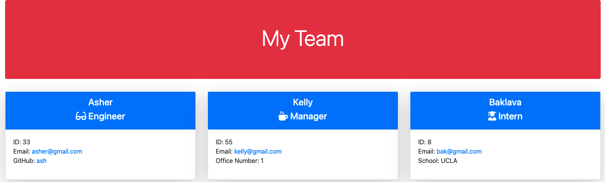
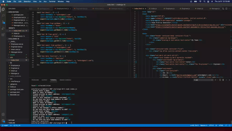

  # Project Title
  team-profile-generator
  
  
  # Description
  This Team Profile Generator is used to create a customized html that displays every team member and information relevant to their roles. An example fo the final display is shown below:

  

  Follow this [link](https://github.com/abergtra/challenge-10) for the GitHub repository and this [link](https://abergtra.github.io/challenge-10/) for the live URL.

  # Table of Contents 
  * [Installation](#-Installation)
  * [Usage](#-Usage)
  * [License](#-Installation)
  * [Contributing](#-Contributing)
  * [Tests](#-Tests)
  * [Questions](#-Questions)
      
  # Installation
  Before you begin, open the "challenge-10" folder in your integrated folder and run the "npm install" command. See gif in the "Usage" section for an installation walkthrough.
  
  # Usage
  Use this program by running the "node index.js" command in the integrated terminal after installation is complete. See gif below for functionality walkthrough:

  
  
  A video walkthrough is also available if you follow this [link](https://youtu.be/Dtcn1Cj4O5M).

  # License 
  [License: MIT](https://opensource.org/licenses/MIT) 
    * As this list provided is not comprehensive, if you need another license, contact the author for additional options. 
    
  
  # Contributing 
  Please contact the author about contributing.
  
  # Tests
  To run the 4 Test Suites, run the "npm run test" command in the integrated terminal after installation is complete. See gif below of tests passing:

  
  
  A video walkthrough is also available if you follow this [link](https://youtu.be/dyfzwXsNpI4).

  # Questions
  * GitHub Username: abergtra
  * Contact Email: asher.bergtraun@gmail.com
